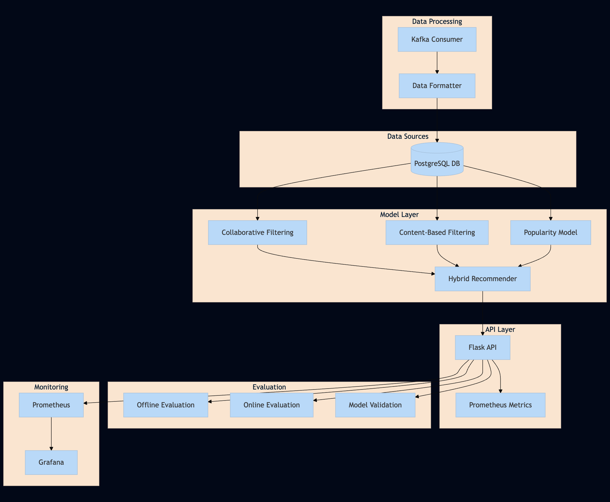

# Netflicks - Movie Recommendation System

A machine learning-based movie recommendation system that provides personalized movie suggestions to users. The system integrates collaborative filtering, content-based filtering, and popularity-based models within a microservices architecture. It features real-time data ingestion, model training, CI/CD, and a REST API.

## System Architecture



The Netflicks recommendation system follows a modular and scalable microservices architecture with the following key components:

### 1. Data Pipeline

* **Data Collection**: Raw movie and user interaction data is simulated and stored in the `data/` directory.
* **Kafka Integration**: Simulated real-time event streams including movie ratings, watch logs, and recommendation requests.
* **Preprocessing**: Data cleaning, transformation, genre standardization, and one-hot encoding in the `preprocessing/` module.
* **Database**: PostgreSQL stores normalized and validated movie, user, rating, and watch history data in the `db/` directory.

### 2. Model Training Pipeline

* **Feature Engineering**: Constructs user-item sparse matrices and genre vectors.
* **Model Training**: Implements collaborative filtering (ALS), content-based filtering (genre similarity), and popularity models in `model_training/`.
* **Model Storage**: Trained models and vectors saved as versioned `.pkl` files in the `models/` directory using MLflow.
* **Model Evaluation**: Performance metrics tracked using offline (RMSE, HitRate) and online evaluation.

### 3. API Service

* **Flask Server**: REST API implemented in `api/` to serve recommendations.
* **Model Serving**: Dynamically serves predictions using CF, CBF, or popularity models depending on user history.
* **Docker Containerization**: API, training, and validation workflows containerized for consistent deployment.
* **Load Balancing**: Designed to handle concurrent user requests.

### 4. Testing & Quality Assurance

* **Unit Tests**: Component-level testing in `testing/`.
* **Pipeline Testing**: Simulates API calls and validates recommendation quality.
* **CI/CD**: Automated retraining, validation, and deployment using Jenkins.

### Data Flow

1. Kafka → Preprocessing → PostgreSQL
2. PostgreSQL → Model Training → Model Artifacts
3. API Request → Inference Engine → Recommendations

## Project Structure

```
.
├── api/                 # API server implementation
├── data/                # Simulated and processed data storage
├── db/                  # PostgreSQL schema and database manager
├── kafka_import/        # Kafka stream simulator
├── model_training/      # Model training scripts for CF, CBF, Popularity
├── models/              # Trained model and vector storage
├── pipeline/            # Offline and online evaluation scripts
├── preprocessing/       # Data transformation, formatting, and loading
└── testing/             # Unit and integration test scripts
```

## Prerequisites

* Python 3.10
* Docker
* pip

## Installation

1. Clone the repository:

```bash
git clone <repository-url>
cd Netflicks
```

2. Create and activate a virtual environment:

```bash
python -m venv .venv
source .venv/bin/activate  # On Windows: .venv\Scripts\activate
```

3. Install dependencies:

```bash
pip install -r requirements.run.txt      # For running the API
pip install -r requirements.train.txt    # For training the model
pip install -r requirements.data.txt     # For data processing
```

## Environment Setup

Create a `.env` file in the root directory with the following variables:

```
# Add your environment variables here
```

## Running the Application

### Using Docker

1. Build the Docker image:

```bash
docker build -f Dockerfile.run -t netflicks-api .
```

2. Run the container:

```bash
docker run -p 8082:8082 -v $(pwd)/models:/app/models netflicks-api
```

### Running Locally

1. Start the API server:

```bash
python api/server.py
```

The API will be available at `http://localhost:8082`

## API Endpoints

* `GET /recommend/{user_id}`: Get movie recommendations for a specific user

## Development

### Training Pipeline

1. Data Preprocessing:

```bash
python preprocessing/preprocess.py
```

2. Model Training:

```bash
python model_training/train.py
```

### Testing

Run tests using:

```bash
python -m pytest testing/
```

## CI/CD

This project uses Jenkins for CI/CD. The pipeline performs the following steps:

* Pulls the latest data version using DVC
* Trains models and logs them to MLflow
* Validates and deploys models via Docker containers
* Starts monitoring services (Prometheus, Grafana)

Configuration:

* Jenkinsfile defines stages for preprocessing, training, validation, API testing, and monitoring.
* Containers: `Dockerfile.train`, `Dockerfile.validate`, `Dockerfile.run`
* Monitoring: Prometheus scrapes metrics; Grafana displays dashboards

Benefits:

* Builds triggered on code commits or daily schedule
* Secrets handled via Jenkins credentials
* Consistent environments across dev, test, and prod

Monitoring Dashboards:

* Request latency histogram
* Recommendation count per user
* Recommendation item count
* User segment activity breakdown

MLflow & DVC:

* MLflow tracks metrics, parameters, and artifacts for each model
* DVC manages dataset versions

Check out the demo: [Netflicks Demo](https://drive.google.com/file/d/1CCdUNZVvgnFCJ4mvuCaf0cEBxrtRKx2A/view?usp=sharing)
